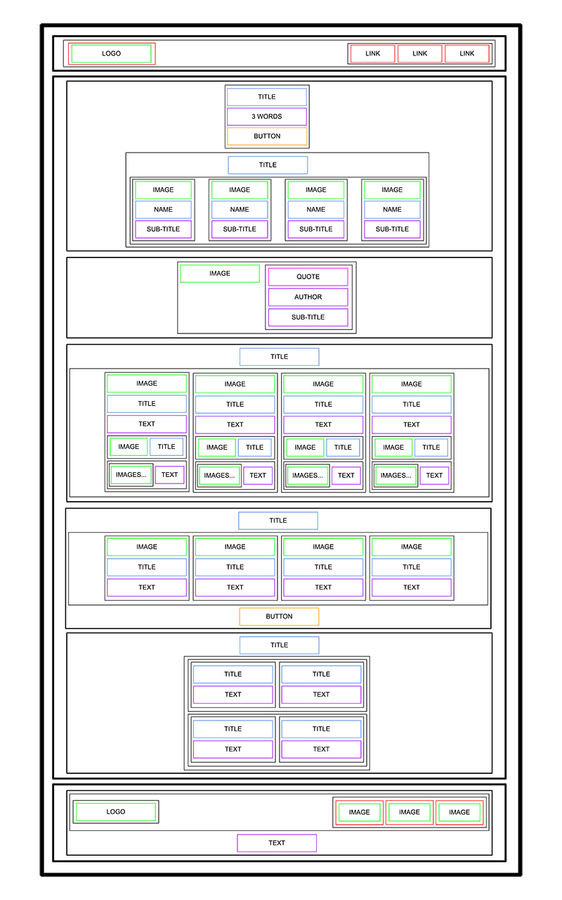

# README 

## Resources:books:
Read or watch:
* [Learn to Code HTML & CSS](https://learn.shayhowe.com/html-css/)
* [Introduction to HTML](https://developer.mozilla.org/en-US/docs/Learn/HTML/Introduction_to_HTML)
* [MDN](https://developer.mozilla.org/en-US/)
---

## Learning Objectives:bulb:
What you should learn from this project:

- What is HTML
- How to create an HTML page from a wireframe
- What is a markup language
- What is the DOM
- What is an element / tag
- What is an attribute
- What the purpose of each HTML tag
---

## Requirements
### General
- All your files should end with a new line
- A README.md file, at the root of the folder of the project is mandatory
- You are not allowed to install, import or use external libraries. This website must be build with only HTML/CSS/JavaScript. No NodeJS, React, - VueJS, Bootstrap, etc.
- Your code should be W3C compliant and validate with [W3C-Validator](https://github.com/hs-hq/W3C-Validator)
---

# 1. What is HTML? :bookmark_tabs:
HTML (HyperText Markup Language) is a markup language used to structure and present content on web pages. It provides the basic structure of a web page by using tags and elements to define different parts of the content, such as headings, paragraphs, links, images, and more.

## 2. How to create an HTML page from a wireframe?
To create an HTML page from a wireframe, you can follow these steps:
   - Identify the main elements and components in the wireframe, such as headers, sections, images, forms, etc.
   - Use the appropriate HTML tags for each identified element in the wireframe.
   - Assign appropriate classes and attributes to apply specific styles and functionalities using CSS and JavaScript, respectively.
   - Organize and structure the elements following the proper hierarchy using the appropriate HTML tags, such as `<header>`, `<nav>`, `<main>`, `<section>`, `<footer>`, etc.
   - Add real or dummy content to the elements as specified in the wireframe.

## 3. What is a markup language?
A markup language is a set of rules and tags used to define the structure and presentation of content in a document. These tags or marks are used to delimit specific parts of the content and provide information on how those parts should be displayed or interpreted.

## 4. What is the DOM?
The DOM (Document Object Model) is a structured, object-oriented representation of the content of an HTML document (or other document types). It provides a programming interface that allows dynamic access and manipulation of the elements, attributes, and content of the document using programming languages like JavaScript.

## 5. What is an element/tag?
An element (also known as a tag) in HTML is a construct that represents a specific component or part of the content in a web page. It is defined by an opening tag and a closing tag, and it can contain other nested elements and text. Examples of HTML elements are `<h1>` (heading level 1), `
` (paragraph), `<a>` (link), `` (image), etc.

## 6. What is an attribute?
An attribute in HTML provides additional information about an element and is specified within the opening tag of the element. Attributes can influence the appearance, behavior, or functionality of the element. For example, the `href` attribute is used in the `<a>` element to specify the target URL of the link, and the `src` attribute is used in the `` element to specify the source of the image.

## 7. What is the purpose of each HTML tag?
Each HTML tag has a specific purpose and is used to represent different types of content. Some examples are:
   - `<h1>`, `<h2>`, `<h3>`: Headings of different levels.
   - `
`: Text paragraphs.
   - `<a>`: Links to other pages or resources.
   - ``: Images displayed on the page.
   - `<ul>`, `<ol>`, `<li>`: Unordered and ordered lists and list items.
   - `<table>`, `<tr>`, `<td>`: Tables and table rows/columns.
   - `<form>`, `<input>`, `<button>`: Forms and input fields/buttons for user interaction.
   - `
`, ``: General purpose containers for grouping and styling elements.

## Author
- **Manuel Zambrano** - [mnlazs](https://github.com/mnlazs) :rage4:
